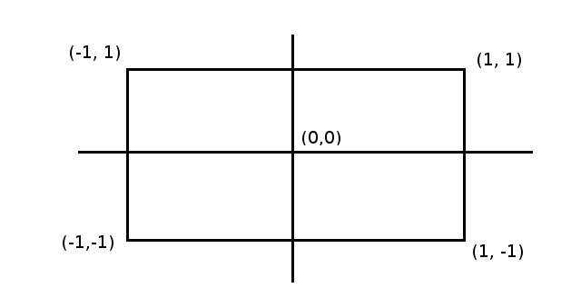
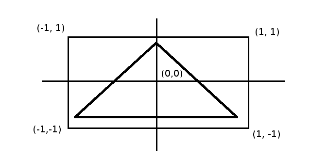

# WebGL lightning talk

- Native 2D/3D graphics library Javascript API for the browser
- Renders on HTML5 `<canvas>` elements.
- Code written for WebGL runs on the GPU.
- API is shader based and conforms closely to the OpenGL ES 2.0 spec

----

## OpenGL ES

- Cross-platform 2D/3D graphics API.
- Creates an interface for control over low-level graphics hardware operations.
- Maintenance of API has been handed over to the Khronos Group
- Graphics vendors, such as Nvidia and Intel, create extensions on top of the API to make it fit their needs and add functionality

---

## Shaders

- Code provided to run on the GPU is written in the form of shaders.
- Shaders are a composition of 5 different data types which are `Attributes`, `Buffers`, `Uniforms`, `Textures` and `Varyings`.
- Code for shaders is written in a strictly typed language called GL Shader Language.
- Data/properties that comprise the shaders, however, can be provided from Javascript and passed to the Shaders.

----

## Shaders
### Vertex

- Coordinates of your program


----

## Shaders
### Vertex
```Javascript
vertices = [
    -0.9, -0.9, 0.0,
     0.9, -0.9, 0.0,
     0.0,  0.9, 0.0
];
```


----
## Shaders
### Vertex

```C
attribute vec4 coords;
attribute float pointSize;
uniform mat4 transformMatrix;
void main(void) {
    gl_Position = transformMatrix * coords;
    gl_PointSize = pointSize;
}
```

----
## Shaders
### Fragment

Coloring of your program

```C
precision mediump float;
uniform vec4 color;
void main(void) {
    gl_FragColor = color;
}
```

---

Manipulating properties of a shader from JS

```Javascript
var pointSize = gl
  .getAttribLocation(shaderProgram, "pointSize");

gl.vertexAttrib1f(pointSize, 20);

var color = gl
  .getUniformLocation(shaderProgram, "color");

gl.uniform4f(color, 0, 0, 0, 1);
```

---

Talking points

- What are real-world usages of WebGL in the modern web space?
- Why would you want to use SVG vs. WebGL?
- Are there any Slalom projects that have used WebGL?
  - Or a library like three.js which wraps it?

---

## References and Resources

- https://www.khronos.org/opengl/
- https://www.khronos.org/webgl/
- http://webglfundamentals.org/webgl/lessons/webgl-fundamentals.html
- https://developer.mozilla.org/en-US/docs/Web/API/WebGL_API
- http://threejs.org/
- https://egghead.io/courses/create-3d-graphics-in-javascript-using-webgl
- http://www.html5rocks.com/en/tutorials/webgl/webgl_fundamentals/
